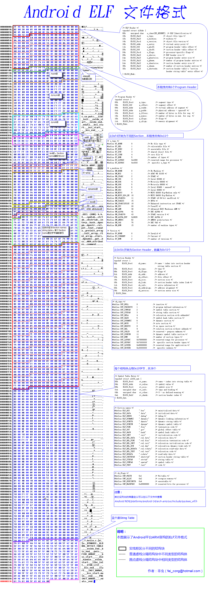

# ELF文件格式解析

由于现在的App对安全的要求越来越高，进行Android的逆向工作，绕不过去的就是它的native层。整个Android的native基于C/C++开发，编译为Linux系统下的ELF(Executable and Linkable Format)文件，也就是说，我们在Android中使用的.so文件也是ELF文件的一种格式(具体来讲，其是Linkable格式的一种)。

# ELF文件格式介绍

我们要进行ELF文件的解析工作，首先要了解ELF文件的格式。关于ELF文件格式的介绍，网络上已经有许多成熟的资料，这里借鉴两个非常具有袜跟性的资料来辅助我们进行解析工作：   
第一是非虫的经典之作：

第二是北京大学实验室出的标准版：    
<http://download.csdn.net/detail/jiangwei0910410003/9204051>

从上面的两个资料了解了整个ELF文件的格式以后就可以着手进行解析工作了。

# 工具
Linux下可以使用的读取ELF文件相关工具为readelf，其比较有用的参数有：   
  * -a = -h -l -S -s -r -d -V -A -I
  * -h = --file-header Display the ELF file header
  * -l = --program-headers Display the program headers
  * -S = --section-headers Display the sections' header
  * -s = --symbols Display the symbol table
  * -r = --relocs Display the relocations (if present)
  * -d = --dynamic Display the dynamic section (if present)
  * -V = --version-info Display the version sections (if present)
  * -A = --arch-specific Display architecture specific information (if any)
  * -I = --histogram Display histogram of bucket list lengths
  * -x = --hex-dump=<number|name> Dump the contents of section <number|name> as bytes
  * -p = --string-dump<number|name> Dump the contents of section <number|name> as strings

# 解析(Python)
